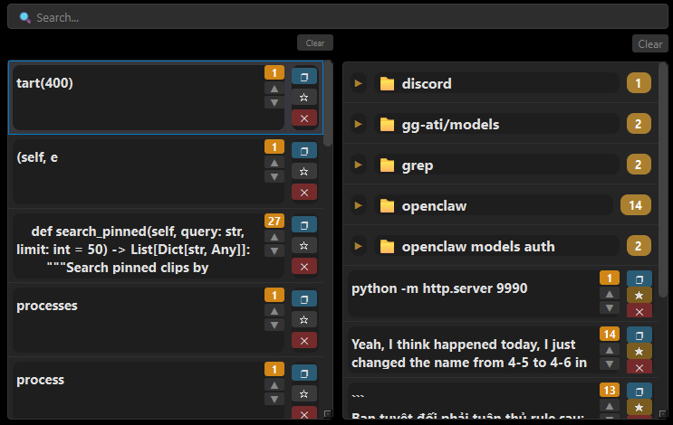
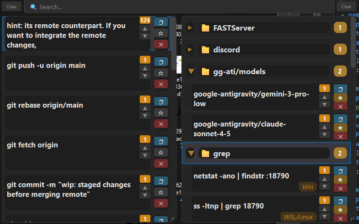

# Advance Clipboard Manager

A lightweight, fast clipboard manager for Windows with SQLite storage, group organization, and JSON backup.


## Features

- **History & Pinned**: Separate lists for recent clips and pinned favorites
- **Text & Image Support**: Store both text snippets and images
- **Duplicate Detection**: MD5 hash prevents duplicate entries
- **Tagging**: Add custom tags to pinned items
- **Groups**: Organize pinned clips into collapsible groups (e.g., `docker`, `ssh`)
- **Search**: Real-time search across pinned clips
- **Quick Paste**: Click or Enter to paste directly into active window
- **SQLite Storage**: Fast, reliable database with WAL mode
- **Auto Backup**: JSON backup every 30 seconds with checksum validation
- **Disaster Recovery**: Auto-restore from backup if database corrupts

## Installation

```bash
# Clone repository
git clone https://github.com/yourusername/advance-clipboard.git
cd advance-clipboard

# Install dependencies
pip install -r requirements.txt

# Run
python main.py
```

## Usage

| Hotkey | Action |
|--------|--------|
| `Ctrl+Alt+V` | Toggle clipboard manager |
| `Esc` | Hide window |
| `Enter` | Paste selected item |
| `Click item` | Paste item |

### Item Actions

| Button | Action |
|--------|--------|
| `❐` | Copy to clipboard (no paste) |
| `☆/★` | Pin/Unpin item |
| `✕` | Delete item |
| `▲/▼` | Move item up/down |

### Context Menu (Right-click on pinned item)

| Action | Description |
|--------|-------------|
| `📁 Add to Group` | Add clip to existing group |
| `➕ New Group...` | Create new group and add clip |
| `❌ Remove from 'group'` | Remove clip from current group |
| `🏷️ Add Tag` | Add/edit tag |

### Search Box

- Type to filter pinned clips in real-time
- **Triple-click** to clear search
- Search is cleared after paste

### Groups

- Click group header to expand/collapse
- Group state persists across hide/show
- Clips in same group are visually grouped together

## Screenshots





## Architecture

```
┌─────────────┐     ┌─────────────┐     ┌─────────────┐
│  Clipboard  │────▶│   SQLite    │────▶│     UI      │
│  Monitor    │     │  (storage)  │     │   (PyQt6)   │
└─────────────┘     └──────┬──────┘     └─────────────┘
                           │
                           ▼ (30s debounce)
                    ┌─────────────┐
                    │ JSON Backup │
                    └─────────────┘
```

### Data Flow

- **Read**: UI ← SQLite (pagination, 20 items/page)
- **Write**: Clipboard change → SQLite (immediate, <5ms)
- **Backup**: SQLite → JSON (every 30s or on exit)
- **Recovery**: JSON → SQLite (on corrupt DB)

## File Structure

```
advance-clipboard/
├── main.py              # UI and app logic (PyQt6)
├── storage.py           # SQLite storage layer
├── backup_manager.py    # JSON backup with checksum
├── requirements.txt
├── README.md
├── LICENSE
├── .gitignore           # ignores generated files & sensitive data
├── clipboard.db         # SQLite database (generated at runtime, not tracked)
├── images/              # Image storage (generated at runtime)
└── backups/             # JSON backups (generated at runtime)
```

> **Note:** The repository uses `.gitignore` to exclude runtime artifacts such as `clipboard.db`,
> the `images/` and `backups/` folders, log files, and other temporary data.  `data.json` is a
> legacy file and should not be committed.

## Configuration

Edit constants in `main.py`:

```python
PAGE_SIZE_HISTORY = 20    # Items per page (history)
PAGE_SIZE_PINNED = 50     # Items per page (pinned)
MAX_DISPLAY_CHARS = 300   # Text truncation limit
```

Backup settings in `backup_manager.py`:

```python
MAX_BACKUPS = 10          # Keep last N backups
```

## Requirements

- Python 3.10+
- Windows 10/11
- PyQt6
- pynput

## License

MIT License
