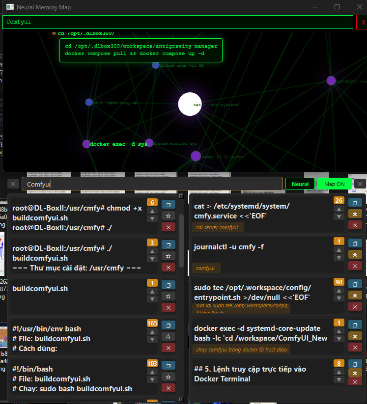
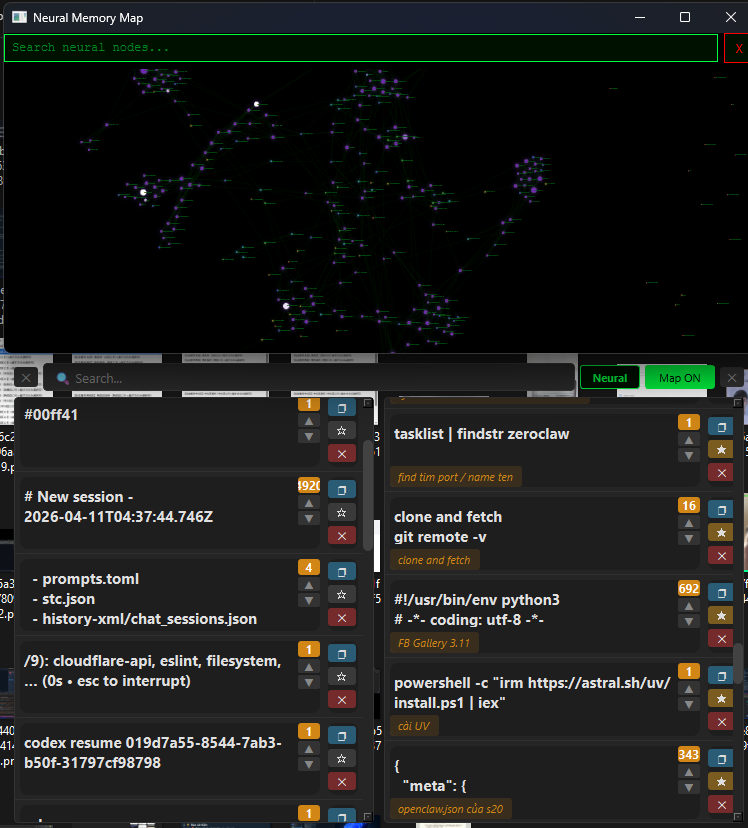

# Advance Clipboard Manager

A powerful clipboard manager for Windows with SQLite storage, group organization, hybrid search, and an AI-powered **Neural Memory Map** that visualizes semantic relationships between your clips as an interactive galaxy.


## Screenshots

**Main UI with Neural Memory Map — hover a node to inspect clip content:**



**Galaxy overview — zoomed out to see the full clip network:**



## Features

### Clipboard Manager
- **History & Pinned**: Separate lists for recent clips and pinned favorites
- **Text & Image Support**: Store both text snippets and images
- **Duplicate Detection**: MD5 hash prevents duplicate entries
- **Tagging**: Add custom tags to pinned items
- **Groups**: Organize pinned clips into collapsible groups (e.g., `docker`, `ssh`)
- **Quick Paste**: Click or Enter to paste directly into active window
- **SQLite Storage**: Fast, reliable database with WAL mode
- **Auto Backup**: JSON backup every 30 seconds with checksum validation
- **Disaster Recovery**: Auto-restore from backup if database corrupts

### Hybrid Search
- **Real-time lexical + light RAG retrieval** across pinned and history
- Incremental RAG index — new clips added instantly, full rebuild once per day in background
- Search **never blocks** the UI — falls back to instant SQL if RAG index isn't ready

### Neural Memory Map

An AI-powered visualization that maps semantic relationships between your clipboard clips:

- **AI Indexing**: Uses `sentence-transformers/all-MiniLM-L6-v2` to encode clip embeddings on CPU
- **Background Processing**: Daemon thread — never lags the UI
- **Bounded Window**: Only indexes pinned clips + N most recent clips (configurable), not your entire history
- **Lexical Boosting**: Commands with shared prefixes (e.g., `/acp spawn codex`, `/acp spawn gemini`) get similarity boosts even when cosine similarity alone is low
- **Galaxy Visualization**: D3.js force-directed graph with:
  - Rainbow node colors by degree (red → violet)
  - Twinkling star animation
  - HTML tooltips showing up to 900 characters on hover
  - Always-visible labels
  - Config-driven visual settings (colors, sizes, forces, thresholds)
- **Two display modes**:
  - **Neural** button → floating independent window with its own search bar
  - **Map ON/OFF** button → docked to main UI, hides together with Ctrl+Alt+V
- **Live config reload**: Edit `neural/config.json` → close/reopen map → changes apply instantly

## Installation

```bash
git clone https://github.com/Hiroshimeow/Advance-Clipboard.git
cd Advance-Clipboard
uv sync
uv run main.py
```

### Windows launchers

- `adv-clip.bat`: visible console launch, useful for debugging.
- `adv-clip.vbs`: hidden background launch.

### Troubleshooting

If Python fails with standard library mismatch errors, clear inherited Python env variables:

```powershell
$env:PYTHONHOME=$null
$env:PYTHONPATH=$null
```

## Usage

| Hotkey | Action |
|--------|--------|
| `Ctrl+Alt+V` | Toggle clipboard manager |
| `Esc` | Hide window |
| `Enter` | Paste selected item |
| `Click item` | Paste item |

### Item Actions

| Button | Action |
|--------|--------|
| `❐` | Copy to clipboard (no paste) |
| `☆/★` | Pin/Unpin item |
| `✕` | Delete item |
| `▲/▼` | Move item up/down |

### Context Menu (Right-click on pinned item)

| Action | Description |
|--------|-------------|
| `📁 Add to Group` | Add clip to existing group |
| `➕ New Group...` | Create new group and add clip |
| `❌ Remove from 'group'` | Remove clip from current group |
| `🏷️ Add Tag` | Add/edit tag |

### Neural Memory Map

| Button | Behavior |
|--------|----------|
| **Neural** | Opens a floating map window (independent, stays open) |
| **Map ON/OFF** | Docks map to main UI (hides together with Ctrl+Alt+V) |

- **Search in map**: Use the search bar inside the map window to highlight matching nodes
- **Hover nodes**: Shows tooltip with clip content (up to 900 chars)
- **Click nodes**: Searches for that clip in the main UI

### Search

- Type to filter pinned clips in real-time (200ms debounce)
- Hybrid retrieval combines SQL matching with local semantic reranking
- **Triple-click** or **Clear button** to clear search text
- Search is cleared after paste

### Groups

- Click group header to expand/collapse
- Group state persists across hide/show
- Clips in same group are visually grouped together

## Architecture

```
┌─────────────┐     ┌─────────────┐     ┌─────────────┐     ┌─────────────┐
│  Clipboard   │────▶│   SQLite    │────▶│  Light RAG  │────▶│     UI      │
│  Monitor     │     │  (storage)  │     │ (retrieval) │     │   (PyQt6)   │
└─────────────┘     └──────┬──────┘     └─────────────┘     └──────┬──────┘
                           │                                       │
                    ┌──────┴──────┐                         ┌──────┴──────┐
                    │ JSON Backup │                         │   Sidecar   │
                    │ (30s cycle) │                         │ Neural Map  │
                    └─────────────┘                         │  (D3.js)   │
                                                            └──────┬──────┘
                                                                   │
                                                            ┌──────┴──────┐
                                                            │   Neural    │
                                                            │   Engine    │
                                                            │ (AI thread) │
                                                            └─────────────┘
```

### Data Flow

- **Read**: UI ← hybrid retrieval ← SQLite (pagination, 20 items/page)
- **Write**: Clipboard change → SQLite (immediate, <5ms) → incremental neural index
- **Search**: SQL lexical + local semantic reranking (no external API)
- **Neural**: Background thread encodes embeddings → computes cosine similarity + lexical boosts → stores links in SQLite
- **Backup**: SQLite → JSON (every 30s or on exit)
- **Recovery**: JSON → SQLite (on corrupt DB)

## File Structure

```
advance-clipboard/
|-- main.py
|-- core/
|   |-- clipboard_monitor.py
|   `-- paste_service.py
|-- storage/
|   |-- backup.py
|   |-- clips.py
|   |-- db.py
|   |-- neural.py
|   |-- rag_search.py
|   `-- search.py
|-- ui/
|   |-- clipboard_browser_controller.py
|   `-- widgets.py
|-- neural/
|   |-- engine.py
|   |-- indexer.py
|   |-- ui.py
|   |-- config.json
|   `-- graph/
|-- docs/
|   |-- CASE_STUDY.md
|   |-- ADR/
|   `-- screenshots/
|-- tests/
|-- adv-clip.bat
|-- adv-clip.vbs
|-- pyproject.toml
`-- uv.lock
```

> **Note:** Runtime artifacts (`clipboard.db`, `images/`, `backups/`, `logs/`) are excluded via `.gitignore`.

## Configuration

### Neural Memory Map (`neural/config.json`)

All settings are config-driven with `_doc_*` descriptions. Key settings:

| Setting | Default | Description |
|---------|---------|-------------|
| `max_recent_index` | 300 | Recent clips to index (bounded window) |
| `similarity_threshold` | 0.45 | Min cosine similarity to create a link |
| `max_neighbors` | 5 | Max links per clip |
| `lexical_prefix_boost` | 0.30 | Boost for shared command prefixes |
| `graph.rainbow_mode` | true | Rainbow colors by node degree |
| `graph.twinkle_enabled` | true | Twinkling star animation |
| `graph.tooltip_max_chars` | 900 | Max chars shown on hover |

### App Settings (`main.py`)

```python
PAGE_SIZE_HISTORY = 20    # Items per page (history)
PAGE_SIZE_PINNED = 50     # Items per page (pinned)
MAX_DISPLAY_CHARS = 300   # Text truncation limit
```

## Requirements

- Python 3.11-3.13
- Windows 10/11
- PyQt6, PyQt6-WebEngine
- sentence-transformers (CPU only, ~90MB model download on first run)
- numpy


## Engineering Case Study

For architecture decisions, trade-offs, and refactor notes, see:

- [Engineering Case Study](docs/CASE_STUDY.md)
- [Architecture Decision Records](docs/ADR/)

## License

MIT License
